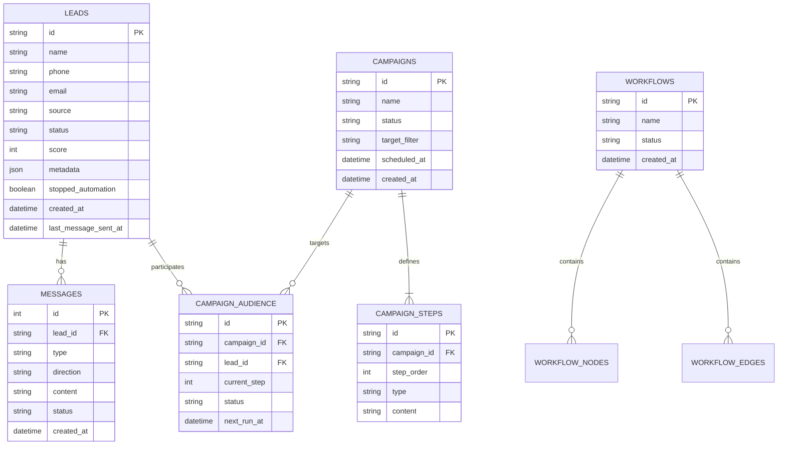

# Database Schema Design (ERD)
**Project:** MCE Platform
**Date:** 2025-12-28
**Database Engine:** SQLite
**File:** `mce.db`

## 1. Entity Relationship Diagram

## 2. Table Definitions

### 2.1 leads
Stores all potential contacts.
*   `id`: TEXT PRIMARY KEY (UUID)
*   `name`: TEXT
*   `phone`: TEXT UNIQUE NOT NULL
*   `email`: TEXT
*   `source`: TEXT (e.g., 'csv', 'webhook')
*   `status`: TEXT (default: 'NEW')
*   `score`: INTEGER (default: 0)
*   `metadata`: TEXT (JSON String)
*   `stopped_automation`: INTEGER (Boolean 0/1, default: 0)
*   `created_at`: DATETIME
*   `updated_at`: DATETIME

### 2.2 messages
Stores chat history for both inbound and outbound.
*   `id`: INTEGER PRIMARY KEY AUTOINCREMENT
*   `lead_id`: TEXT FOREIGN KEY -> leads(id)
*   `type`: TEXT (default: 'text')
*   `direction`: TEXT ('inbound', 'outbound')
*   `content`: TEXT
*   `status`: TEXT ('sent', 'delivered', 'read')
*   `created_at`: DATETIME

### 2.3 campaigns
Stores high-level campaign configurations.
*   `id`: TEXT PRIMARY KEY (UUID)
*   `name`: TEXT NOT NULL
*   `status`: TEXT ('DRAFT', 'RUNNING', 'PAUSED', 'COMPLETED')
*   `target_filter`: TEXT (JSON or SQL condition string)
*   `scheduled_at`: DATETIME (Nullable)

### 2.4 campaign_steps
Stores the sequence of actions for a campaign.
*   `id`: TEXT PRIMARY KEY
*   `campaign_id`: TEXT FOREIGN KEY -> campaigns(id)
*   `step_order`: INTEGER NOT NULL
*   `type`: TEXT ('WHATSAPP', 'DELAY', 'EMAIL')
*   `content`: TEXT (Message body or Delay duration in hours)

### 2.5 campaign_audience
Tracks the progress of each lead through a campaign.
*   `id`: TEXT PRIMARY KEY
*   `campaign_id`: TEXT FOREIGN KEY
*   `lead_id`: TEXT FOREIGN KEY
*   `current_step`: INTEGER (Pointer to step_order)
*   `status`: TEXT ('PENDING', 'COMPLETED', 'FAILED')
*   `next_run_at`: DATETIME (Scheduled time for next step)

### 2.6 workflows
Automation definitions.
*   `id`: TEXT PRIMARY KEY
*   `name`: TEXT
*   `status`: TEXT ('ACTIVE', 'INACTIVE')

### 2.7 workflow_nodes & workflow_edges
Stores the graph structure for the Visual Builder.
*   *Configured to match React Flow data structure JSON serialization.*

---
*Generated by Antigravity*
