# Functional Decomposition (The "Tree" Method)
**Project:** MCE Platform
**Date:** 2025-12-28
**Purpose:** Break down the complex system into smaller, manageable functional components.

## 1. Visual Hierarchy

```mermaid
graph TD
    Root[MCE Platform]
    
    %% Level 1: Modules
    LM[Lead Management]
    WC[WhatsApp Comm.]
    CM[Campaign Mgmt.]
    AW[Automation/Workflow]
    AR[Analytics/Reports]
    
    Root --> LM
    Root --> WC
    Root --> CM
    Root --> AW
    Root --> AR
    
    %% Level 2: Lead Management
    LM --> LM_Ingest[Ingestion]
    LM --> LM_Org[Organization]
    LM --> LM_State[State Mgmt]
    
    LM_Ingest --> LM_Ingest_CSV[CSV Import]
    LM_Ingest --> LM_Ingest_Sheet[Sheet Sync]
    LM_Ingest --> LM_Ingest_Hook[Webhook]
    
    LM_Org --> LM_Org_List[List View]
    LM_Org --> LM_Org_Detail[Detail Card]
    LM_Org --> LM_Org_Dedupe[Deduplication]
    
    %% Level 2: WhatsApp
    WC --> WC_Sess[Session Mgmt]
    WC --> WC_Msg[Messaging]
    
    WC_Sess --> WC_Sess_Conn[Connect/QR]
    WC_Sess --> WC_Sess_Rest[Restore]
    
    WC_Msg --> WC_Msg_Send[Send Text]
    WC_Msg --> WC_Msg_Recv[Receive/Listen]
    WC_Msg --> WC_Msg_Sync[History Sync]
    
    %% Level 2: Campaigns
    CM --> CM_Def[Definition]
    CM --> CM_Exec[Execution]
    
    CM_Def --> CM_Def_Create[Create Steps]
    CM_Def --> CM_Def_Seg[Segmentation]
    
    CM_Exec --> CM_Exec_Start[Init Audience]
    CM_Exec --> CM_Exec_Queue[Batch Queue]
    
    %% Level 2: Automation
    AW --> AW_Eng[Workflow Engine]
    AW --> AW_UI[Visual Builder]
    
    AW_Eng --> AW_Eng_Trig[Triggers]
    AW_Eng --> AW_Eng_Act[Actions]
    
    %% Level 2: Analytics
    AR --> AR_Dash[Dashboard]
    AR --> AR_Met[Metrics]
    
    AR_Dash --> AR_Dash_Feed[Live Feed]
    AR_Met --> AR_Met_Vol[Msg Volume]
    AR_Met --> AR_Met_Kill[Kill Switch Stats]
```

## 2. Textual Decomposition

### 1.0 Lead Management Module
*   **1.1 Ingestion Function**
    *   1.1.1 **CSV Import:** Parse uploaded CSV files (`csv-parser`), validate headers, and insert records.
    *   1.1.2 **Sheet Sync:** Poll configured Google Sheet URLs, fetch text data, and map to Lead objects.
    *   1.1.3 **Webhook Input:** Accept generic JSON payloads via API to create leads.
*   **1.2 Organization Function**
    *   1.2.1 **List Retrieval:** Fetch paginated leads with filtering/sorting.
    *   1.2.2 **Detail View:** Retrieve specific attributes and metadata for a single lead ID.
    *   1.2.3 **Deduplication:** Check `phone` column against DB before insertion to prevent redundancy.
*   **1.3 State Management**
    *   1.3.1 **Status Tracking:** Update flow stage (New, Contacted, Qualified).
    *   1.3.2 **Scoring:** Increment integer score based on activity.

### 2.0 WhatsApp Communication Module
*   **2.1 Session Management**
    *   2.1.1 **Initial Connection:** Launch Puppeteer, generate QR code stream.
    *   2.1.2 **Restoration:** Load `.wwebjs_auth` to bypass QR scan on restart.
    *   2.1.3 **Lifecycle Handling:** Auto-reconnect on disconnection.
*   **2.2 Messaging Function**
    *   2.2.1 **Outbound Send:** Format phone number (`@c.us`), dispatch message, return status.
    *   2.2.2 **Inbound Listener:** Detect incoming `message` events, find/create lead, log content.
    *   2.2.3 **History Sync:** Backward fill of last 20 messages for active chats.

### 3.0 Campaign Management Module
*   **3.1 Definition Function**
    *   3.1.1 **Campaign Builder:** Create container, define name and schedule.
    *   3.1.2 **Step Logic:** Add ordered steps (Message, Delay).
    *   3.1.3 **Segmentation Preview:** Test criteria against lead database (Tags/Status).
*   **3.2 Execution Function**
    *   3.2.1 **Audience Initialization:** Snapshot eligible leads into `campaign_audience`.
    *   3.2.2 **Batch Processing:** Worker job to process 'PENDING' steps for the current batch.

### 4.0 Automation & Workflow Module
*   **4.1 Workflow Engine**
    *   4.1.1 **Trigger Evaluation:** Listen for `LEAD_CREATED` or `STATUS_CHANGED` events.
    *   4.1.2 **Condition Logic:** Check if Lead matches criteria (if any).
    *   4.1.3 **Action Execution:** Execute defined task (e.g., call `WhatsApp.sendMessage`).
*   **4.2 Visual Builder Support**
    *   4.2.1 **Graph Persistence:** Save/Load Nodes and Edges for React Flow.

### 5.0 Analytics & Reporting Module
*   **5.1 Dashboard Views**
    *   5.1.1 **Real-time Feed:** Stream latest lead activities.
    *   5.1.2 **Chart Data:** Aggregate data for visualization (Line/Area charts).
*   **5.2 Specific Metrics**
    *   5.2.1 **Volume Counters:** Count total messages (In/Out).
    *   5.2.2 **Kill Switch Analysis:** Track leads who opted out/replied to stop requests.

---
*Generated by Antigravity*
