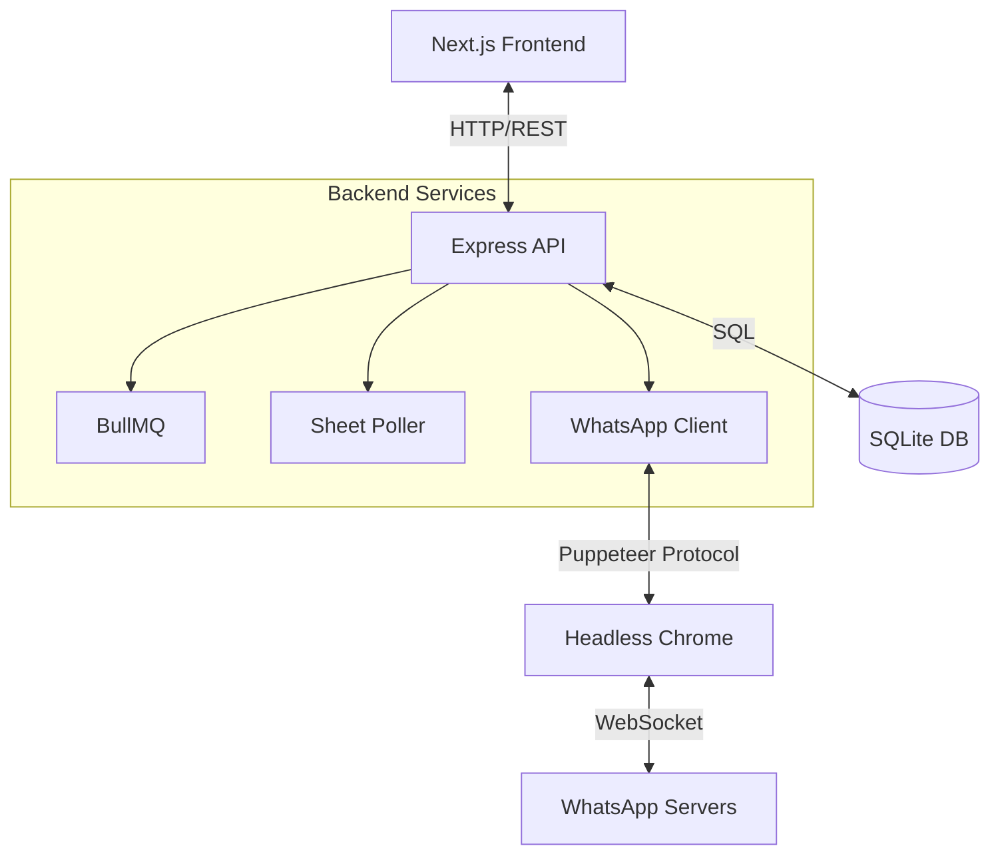

# System Architecture Design (HLD)
**Project:** MCE Platform
**Date:** 2025-12-28
**Scope:** High-Level Technical Architecture

## 1. Architectural Pattern
The MCE Platform follows a **Monolithic Client-Server Architecture** with a specialized **Bridge Service** for WhatsApp.

*   **Client (Frontend):** A Single Page Application (SPA) built with Next.js. Responsible for UI, State Management, and API communication.
*   **Server (Backend):** A RESTful API built with Node.js/Express. Responsible for business logic, data persistence, and managing the WhatsApp session.
*   **Database:** Embedded SQLite database for zero-configuration persistence.

## 2. Component Diagram

## 3. Data Flow

### 3.1 Inbound Message Flow
1.  **WhatsApp Server** sends a message packet to the **Headless Chrome** instance via WebSocket.
2.  **WhatsApp Client (`whatsapp-web.js`)** intercepts the packet in the browser context.
3.  The client emits a Node.js event (`message`) to the **Express API**.
4.  The API Service checks if the sender exists in the **SQLite DB**.
    *   *If No:* Create new `Lead`.
    *   *If Yes:* Update `last_message_at`.
5.  The Message is persisted to the `messages` table.
6.  **Socket.io/Polling** notifies the **Frontend** to update the Chat Window.

### 3.2 Automated Campaign Flow
1.  **Marketing Manager** defines a campaign via the Frontend.
2.  Backend saves the campaign structure and initializes the **Audience List** in the DB.
3.  **Job Queue (BullMQ)** picks up `PROCESS_CAMPAIGN_BATCH`.
4.  Worker iterates through pending audience members.
5.  Worker requests **WhatsApp Client** to send the configured message.
6.  Result/Status is updated in the DB.

## 4. Key Technology Decisions

| Component | Technology | Rationale |
| :--- | :--- | :--- |
| **Frontend Framework** | Next.js (React) | Robust routing, server-side capabilities, and rich ecosystem. |
| **Backend Runtime** | Node.js | Non-blocking I/O is ideal for handling real-time chat events. |
| **WhatsApp Bridge** | `whatsapp-web.js` | Allows usage of personal/business numbers without the Official API cost/limitations (Note: Unofficial). |
| **Database** | SQLite | Serverless, zero-config, and sufficient for single-tenant local deployments. |
| **Styling** | TailwindCSS | Rapid UI development and consistent design system. |

## 5. Security & Constraints
*   **Local Execution:** The system is designed to run locally or on a private VPS. It is **not** multi-tenant.
*   **WhatsApp Session:** The `.wwebjs_auth` folder contains sensitive session tokens and must be protected.
*   **Rate Limiting:** The system includes delays in automation queues to prevent WhatsApp bans.

---
*Generated by Antigravity*
